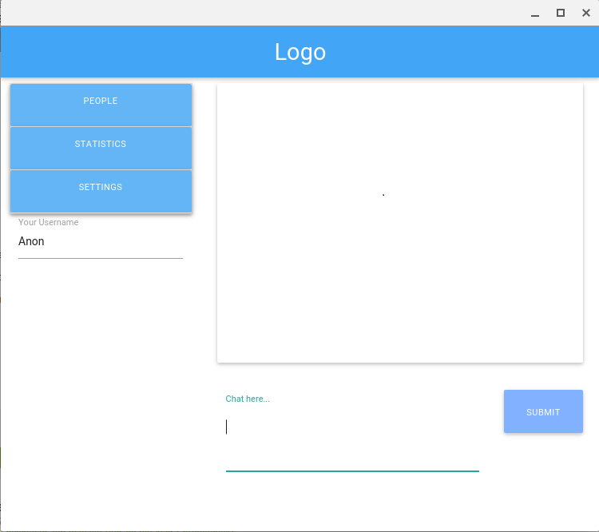

# Live-Page-to-Page-Chat

## What is it?

A web socket based live-chat that only allows users on the same 'web page' to communicate.
You would only be able to message those, for example, watching the exact same youtube video as you, or looking at the same clothing article listing on the same clothing store.

## Why?

Having seen numerous posts on 9gag and imgur commenting on things they've seen on specific websites, I figured it would be interesting to see the kind of conversations that would come of only being able to talk to people interested in literally the exact same thing as you.

Statistics that further track things like most discussed items on a page, would be incredibly useful to send to the owner of the respective page to better indicate what people are interested in.

*WIP.
